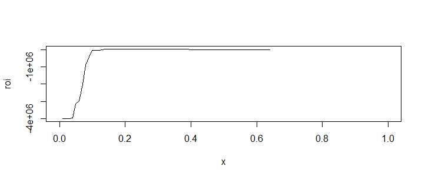

# sample-statistics-modeling-using-R-

目的：利益（LTV－コスト）を最大化させるような重回帰分析モデルを作成する

利用データ：ポーランドのマーケティング結果によるデータ（出所は別途明記）

## 分析アプローチ

### 1.着目したパラメータは以下の通り
- job(職種)：引退者と学生は口座作りやすい
- education(学歴)：学歴が高いと口座作りやすい
- defaultunknown（元利払いを不履行してない⇒但しunknownを不履行していないと仮定)
- poutcomesuccess(過去のキャンペーンで作成した人物は口座作りやすい（但し定期預金2つもつくるか？注意が必要）)
- 他にもマクロ経済要因（インフレ、金利、景況）は無視しがたいが、Euribor3Mなどのデータもあるが今のところは無視、時系列分析？）

ちなみに全要素で重回帰分析するとこんな感じになる。
```
glm(formula = y ~ ., family = "binomial", data = train_data)

Deviance Residuals: 
    Min       1Q   Median       3Q      Max  
-6.2486  -0.2647  -0.1726  -0.1281   3.2189  

Coefficients: (2 not defined because of singularities)
                               Estimate Std. Error z value Pr(>|z|)    
(Intercept)                  -8.226e+03  5.919e+03  -1.390 0.164637    
age                           3.650e-05  3.660e-03   0.010 0.992042    
jobmanagement                -1.517e-02  1.241e-01  -0.122 0.902751    
jobretired                    6.112e-01  1.701e-01   3.592 0.000328 ***
jobservices                  -1.634e-01  1.199e-01  -1.363 0.173003    
jobstudent                    4.479e-01  1.872e-01   2.393 0.016702 *  
jobunknown                   -9.253e-02  8.117e-02  -1.140 0.254274    
maritalmarried               -1.452e-03  9.900e-02  -0.015 0.988294    
maritalsingle                 9.137e-02  1.110e-01   0.823 0.410379    
maritalunknown                1.571e-01  5.566e-01   0.282 0.777715    
educationbasic.6y             1.367e-01  1.685e-01   0.811 0.417259    
educationbasic.9y             2.540e-01  1.324e-01   1.919 0.055030 .  
educationhigh.school          2.161e-01  1.317e-01   1.641 0.100795    
educationilliterate           1.703e+00  1.029e+00   1.656 0.097736 .  
educationprofessional.course  3.256e-01  1.369e-01   2.378 0.017426 *  
educationuniversity.degree    3.954e-01  1.284e-01   3.079 0.002079 ** 
educationunknown              2.472e-01  1.856e-01   1.332 0.182856    
defaultunknown               -2.276e-01  8.536e-02  -2.666 0.007670 ** 
defaultyes                   -7.131e+00  1.971e+02  -0.036 0.971143    
housingunknown               -2.057e-01  2.144e-01  -0.960 0.337274    
housingyes                   -1.929e-02  5.998e-02  -0.322 0.747809    
loanunknown                          NA         NA      NA       NA    
loanyes                      -8.326e-02  8.379e-02  -0.994 0.320426    
contacttelephone             -1.960e-01  1.345e-01  -1.457 0.145000    
monthaug                      7.370e+01  5.307e+01   1.389 0.164893    
monthdec                      8.041e+01  5.651e+01   1.423 0.154744    
monthjul                      2.819e+01  2.027e+01   1.391 0.164190    
monthjun                     -1.911e+01  1.384e+01  -1.380 0.167443    
monthmar                      2.061e+01  1.348e+01   1.529 0.126296    
monthmay                      1.553e+01  1.177e+01   1.319 0.187081    
monthnov                      4.454e+01  3.294e+01   1.352 0.176379    
monthoct                     -1.415e+00  3.447e+00  -0.410 0.681469    
day_of_weekmon                1.016e-01  9.700e-02   1.048 0.294740    
day_of_weekthu                1.771e-01  9.425e-02   1.880 0.060164 .  
day_of_weektue                1.621e-01  9.955e-02   1.628 0.103445    
day_of_weekwed                2.644e-01  9.714e-02   2.722 0.006480 ** 
duration                      5.038e-03  9.904e-05  50.864  < 2e-16 ***
campaign                     -2.924e-02  1.475e-02  -1.983 0.047415 *  
pdays                         2.338e-04  1.100e-03   0.213 0.831707    
previous                     -1.305e-01  3.050e-01  -0.428 0.668819    
poutcomenonexistent           4.942e-01  3.397e-01   1.455 0.145715    
poutcomesuccess               2.185e+00  1.093e+00   1.999 0.045603 *  
emp.var.rate                 -3.086e+01  2.147e+01  -1.437 0.150625    
cons.price.idx                8.744e+01  6.297e+01   1.389 0.164934    
cons.conf.idx                -6.038e-01  4.490e-01  -1.345 0.178675    
euribor3m                    -6.237e-01  8.122e-01  -0.768 0.442539    
nr.employed                          NA         NA      NA       NA    
---
Signif. codes:  0 ‘***’ 0.001 ‘**’ 0.01 ‘*’ 0.05 ‘.’ 0.1 ‘ ’ 1

(Dispersion parameter for binomial family taken to be 1)

    Null deviance: 13938.9  on 25946  degrees of freedom
Residual deviance:  8565.4  on 25902  degrees of freedom
AIC: 8655.4

Number of Fisher Scoring iterations: 10

```
-オッズ比はこんな感じ
```
> exp(hr_data.lr$coefficients)
                 (Intercept)                          age 
                0.000000e+00                 1.000037e+00 
               jobmanagement                   jobretired 
                9.849474e-01                 1.842615e+00 
                 jobservices                   jobstudent 
                8.492421e-01                 1.565054e+00 
                  jobunknown               maritalmarried 
                9.116194e-01                 9.985486e-01 
               maritalsingle               maritalunknown 
                1.095671e+00                 1.170148e+00 
           educationbasic.6y            educationbasic.9y 
                1.146469e+00                 1.289149e+00 
        educationhigh.school          educationilliterate 
                1.241168e+00                 5.492149e+00 
educationprofessional.course   educationuniversity.degree 
                1.384805e+00                 1.484969e+00 
            educationunknown               defaultunknown 
                1.280489e+00                 7.964446e-01 
                  defaultyes               housingunknown 
                7.996451e-04                 8.140862e-01 
                  housingyes                  loanunknown 
                9.808996e-01                           NA 
                     loanyes             contacttelephone 
                9.201162e-01                 8.220189e-01 
                    monthaug                     monthdec 
                1.021772e+32                 8.333133e+34 
                    monthjul                     monthjun 
                1.755806e+12                 5.038994e-09 
                    monthmar                     monthmay 
                8.970985e+08                 5.551747e+06 
                    monthnov                     monthoct 
                2.203813e+19                 2.429680e-01 
              day_of_weekmon               day_of_weekthu 
                1.106982e+00                 1.193808e+00 
              day_of_weektue               day_of_weekwed 
                1.175981e+00                 1.302714e+00 
                    duration                     campaign 
                1.005050e+00                 9.711792e-01 
                       pdays                     previous 
                1.000234e+00                 8.776918e-01 
         poutcomenonexistent              poutcomesuccess 
                1.639180e+00                 8.886791e+00 
                emp.var.rate               cons.price.idx 
                3.958618e-14                 9.450624e+37 
               cons.conf.idx                    euribor3m 
                5.467041e-01                 5.359518e-01 
                 nr.employed 
                          NA 
```

### 2.上記変数によるロジスティック回帰分析を実施

#### 分析結果
堅田コメント
glmの結果を入れると良いと思います。具体的には、

- glmのsummary
```
glm(formula = y ~ job + education + default + poutcome, family = "binomial", 
    data = train_data)

Deviance Residuals: 
    Min       1Q   Median       3Q      Max  
-1.4647  -0.4136  -0.3819  -0.3296   2.5545  

Coefficients:
                              Estimate Std. Error z value Pr(>|z|)    
(Intercept)                   -2.60790    0.13142 -19.844  < 2e-16 ***
jobmanagement                 -0.09536    0.09956  -0.958  0.33818    
jobretired                     0.63019    0.12555   5.019 5.19e-07 ***
jobservices                   -0.14592    0.09728  -1.500  0.13364    
jobstudent                     0.96527    0.14763   6.539 6.21e-11 ***
jobunknown                    -0.07584    0.06491  -1.168  0.24267    
educationbasic.6y              0.07110    0.13407   0.530  0.59586    
educationbasic.9y              0.06168    0.10505   0.587  0.55711    
educationhigh.school           0.11821    0.10366   1.140  0.25412    
educationilliterate            1.40107    0.79803   1.756  0.07914 .  
educationprofessional.course   0.09504    0.10829   0.878  0.38013    
educationuniversity.degree     0.28742    0.10025   2.867  0.00414 ** 
educationunknown               0.12958    0.15116   0.857  0.39133    
defaultunknown                -0.50077    0.06730  -7.441 9.97e-14 ***
defaultyes                    -8.00827  119.46806  -0.067  0.94656    
poutcomenonexistent            0.03094    0.08591   0.360  0.71878    
poutcomesuccess                2.17834    0.15611  13.954  < 2e-16 ***
---
Signif. codes:  0 ‘***’ 0.001 ‘**’ 0.01 ‘*’ 0.05 ‘.’ 0.1 ‘ ’ 1

(Dispersion parameter for binomial family taken to be 1)

    Null deviance: 13939  on 25946  degrees of freedom
Residual deviance: 13553  on 25930  degrees of freedom
AIC: 13587

Number of Fisher Scoring iterations: 9

```

- 変数選択の方法
- オッズ比とその解釈
```
> exp(c_data.lz$coefficients)
                 (Intercept)                jobmanagement 
                0.0736887680                 0.9090464638 
                  jobretired                  jobservices 
                1.8779586159                 0.8642280264 
                  jobstudent                   jobunknown 
                2.6254900829                 0.9269689422 
           educationbasic.6y            educationbasic.9y 
                1.0736910404                 1.0636176467 
        educationhigh.school          educationilliterate 
                1.1254855584                 4.0595584052 
educationprofessional.course   educationuniversity.degree 
                1.0997072113                 1.3329840816 
            educationunknown               defaultunknown 
                1.1383447713                 0.6060622389 
                  defaultyes          poutcomenonexistent 
                0.0003327009                 1.0314186473 
             poutcomesuccess 
                8.8315905934 
```


### 3.利益を最大化する閾値求める ⇒　#フラグたてる：口座作る1ないしは口座作らない0

- 前提：1件あたり売上2000円、コスト500円。売上ーコストを最大化。　→閾値をいくらに設定するべきか？
- 過去データを使った成約率は7.4%。売上ーコスト＝31.5千円　→7.4% を閾値として使うべきか？
- 閾値を1%から100%まで1%刻みで総当り

- 閾値は17%

### 4.ROI = LTV - コスト
- LTV140千円　- コスト
- 最大ROIは33.5千円、閾値は17%

